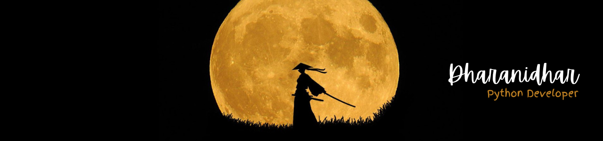

  

<h1 align="center">Hi there, I'm Dharanidhar Reddy! 👋</h1>

  <em>🌱 Currently mastering AI | 🤔 Exploring the world of DevOps | 😄 Pronouns: Dharanidhar | ⚡ Fun Fact: Committed with Computers</em>

<h2 align="center">About Me</h2>

  I'm a Python Developer based in Hyderabad, India. My coding journey is fueled by a passion for technology. Currently, I'm delving into the intricacies of the Flask and Django Frameworks, mastering the art of web development and AI machines. With a commitment to excellence, I find joy in collaborating with computers to turn ideas into reality through code.

<h2 align="center">Contact</h2>

  📧 Email: <a href="mailto:Dharanidharreddy2737@gmail.com">Dharanidharreddy2737@gmail.com</a> 
  📍 Location: Hyderabad, India

<h2 align="center">Skills</h2>

  Python | Django | Flask | FastAPI | REST APIs | GraphQL | Celery | JavaScript | PostgreSQL | MongoDB

<h2 align="center">Portfolio</h2>

  Check out my personal portfolio: <a href="https://dharanidharreddy9.github.io/ecom/" target="_blank">Dharanidhar's Project</a>

<h2 align="center">Get in Touch</h2>

  📫 Connect with me on LinkedIn: <a href="https://www.linkedin.com/in/dharanidhar-reddy-398a51233/">Dharanidhar on LinkedIn</a>

  Let's connect and embark on this exciting journey of knowledge and innovation together!

  <em>Feel free to explore, and happy coding! 🚀</em>

